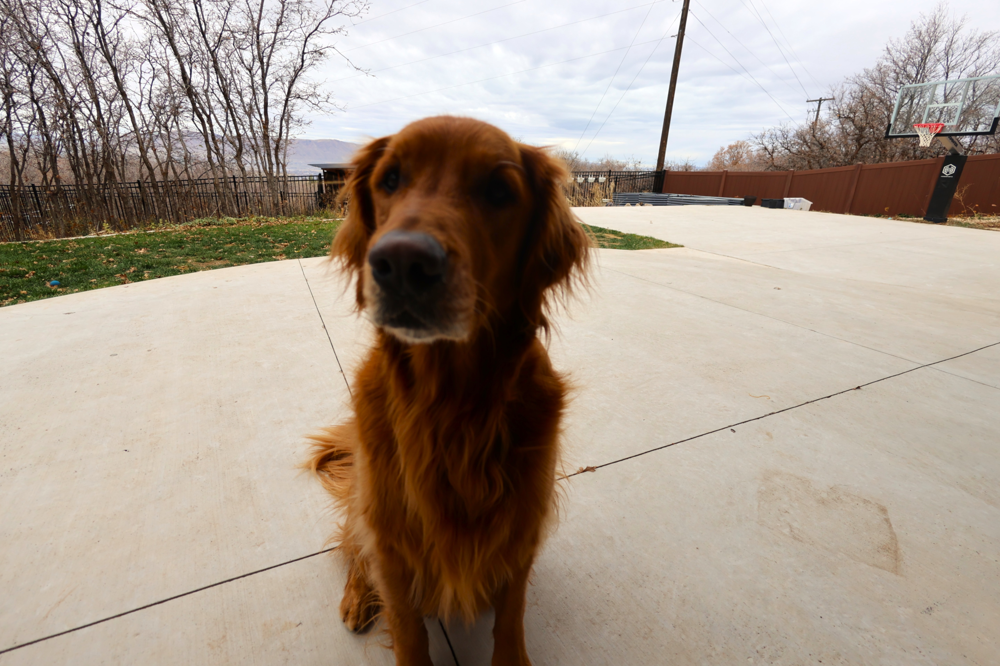

# 🐾 WhiskerWorks Website

**The official home of Archie, Rocco, Des & Pete!**

A single-page responsive website showcasing our YouTube channel [Pawfectly Whiskered](https://www.youtube.com/@PawfectlyWhiskered), featuring DIY pet projects, gear reviews, and upcoming products.

---

## ✨ Features

- 🎨 **Beautiful Design** - Dark theme with gold accents using Tailwind CSS
- 📱 **Fully Responsive** - Mobile-first design with hamburger menu
- 🚀 **GitHub Pages Ready** - Zero build tools, works instantly
- 📊 **Live Stats** - Auto-updating YouTube subscriber count
- 📧 **Waitlist Form** - Email collection using localStorage
- 🐾 **Pet Showcase** - Dedicated cards for all 4 pets
- 🛒 **Gear Section** - Affiliate product links
- 🔮 **Future Products** - Coming soon carousel with SaaS, 3D prints, & merch

---

## 🚀 Quick Deploy to GitHub Pages

### 1. Push to GitHub

```bash
cd whiskerworks-site
git init
git add .
git commit -m "Initial WhiskerWorks site"
git branch -M main
git remote add origin https://github.com/WhiskerWorks72/WhiskerWorks.git
git push -u origin main
```

### 2. Enable GitHub Pages

1. Go to your repo: `https://github.com/WhiskerWorks72/WhiskerWorks`
2. Click **Settings** → **Pages**
3. Under **Source**, select: **main** branch → **/ (root)** folder
4. Click **Save**
5. Wait 1-2 minutes → Your site will be live at:
   ```
   https://whiskerworks72.github.io/WhiskerWorks/whiskerworks-site/
   ```

### 3. (Optional) Custom Domain

If you have `CNAME` file with `whiskerworks.com`:
- Add the domain in **Settings → Pages → Custom domain**
- Update DNS with GitHub's IPs (see [GitHub Docs](https://docs.github.com/en/pages/configuring-a-custom-domain-for-your-github-pages-site))

---

## 📝 How to Customize

### Add Pet Photos

Replace `IMG_LINK_HERE` in `index.html` with your image URLs:

```html
<!-- Before -->


<!-- After -->

```

**Option 1:** Upload images to `whiskerworks-site/assets/images/` folder  
**Option 2:** Use direct URLs from Imgur, Google Photos, etc.

### Update Pet Info

Edit the quirky facts and age in each pet card:

```html
<h3 class="font-playfair text-2xl font-bold mb-2 text-amber-400">Archie</h3>
<p class="text-slate-400 text-sm mb-4">Golden Retriever • 3 years</p>
<ul class="text-slate-300 text-sm space-y-2 mb-6">
    <li>• Loves photoshoots and croissants</li>
    <li>• Steals chicken when you're not looking</li>
    <li>• Professional nap enthusiast</li>
</ul>
```

### Add Gear Items

Copy the gear template block (marked with `<!-- GEAR ITEM TEMPLATE -->`):

```html
<div class="bg-slate-800 rounded-2xl overflow-hidden shadow-lg hover:shadow-2xl transition-all hover:scale-105">
    
    <div class="p-6">
        <h3 class="text-xl font-bold mb-3 text-white">Product Name</h3>
        <a href="YOUR_AMAZON_LINK" target="_blank" 
           class="inline-block bg-amber-500 hover:bg-amber-600 text-slate-900 px-6 py-2 rounded-full font-semibold transition-all">
            View on Amazon
        </a>
    </div>
</div>
```

### Update Channel Stats

Live stats auto-update from YouTube, but you can manually edit the fallback text:

```javascript
// In index.html, find this line:
'📈 20.8K views • 67 subs • 42 gained this month'
```

### Add More Products

Copy the product card template in the "Coming Soon" section:

```html
<div class="min-w-[300px] md:min-w-0 bg-slate-900 rounded-2xl p-8 shadow-xl snap-start">
    <div class="text-5xl mb-4">🎁</div>
    <h3 class="font-playfair text-2xl font-bold mb-4 text-amber-400">New Product</h3>
    <p class="text-slate-300 mb-6">Product description here...</p>
    <a href="#" class="inline-block w-full text-center bg-amber-500 hover:bg-amber-600 text-slate-900 px-6 py-3 rounded-lg font-bold">
        Learn More
    </a>
</div>
```

---

## 📂 File Structure

```
whiskerworks-site/
├── index.html          # Main website file
├── assets/
│   ├── css/
│   │   └── styles.css  # Empty (using Tailwind CDN)
│   └── js/
│       └── main.js     # Mobile menu, forms, smooth scroll
├── CNAME               # Custom domain (optional)
├── LICENSE             # License file
└── README.md           # This file
```

---

## 🎨 Color Palette

- **Primary Gold:** `#F59E0B` (Tailwind: `amber-500`)
- **Dark Background:** `#0F172A` (Tailwind: `slate-900`)
- **Lighter Dark:** `#1E293B` (Tailwind: `slate-800`)
- **Text Gray:** `#94A3B8` (Tailwind: `slate-400`)

---

## 🛠️ Tech Stack

- **HTML5** - Semantic structure
- **Tailwind CSS** - Via CDN (no build required)
- **Vanilla JavaScript** - No frameworks
- **Google Fonts** - Playfair Display + Inter
- **GitHub Pages** - Free hosting

---

## 📊 Live Features

### YouTube Stats Integration

The site automatically fetches your latest subscriber count using:
```javascript
fetch(`https://mixerno.space/api/youtube-channel-counter/user/${CHANNEL_ID}`)
```

If the API fails, it falls back to static text.

### Waitlist Storage

Emails are saved in browser `localStorage`:
```javascript
localStorage.getItem('whiskerworks_waitlist')
```

**To export waitlist** (run in browser console):
```javascript
console.log(JSON.parse(localStorage.getItem('whiskerworks_waitlist')))
```

---

## 🐛 Troubleshooting

### Images not showing?
- Check image URLs are correct
- Make sure images are uploaded to repo or using external URLs
- Try absolute paths: `/whiskerworks-site/assets/images/photo.jpg`

### Stats not updating?
- Check browser console for errors
- Verify `CHANNEL_ID` is correct in `index.html`
- API may be rate-limited (refreshes on page load)

### Mobile menu not working?
- Check `main.js` is loaded
- Verify script runs after page loads (it's at bottom of `<body>`)

### GitHub Pages 404?
- Ensure branch is set to `main` in Settings → Pages
- Check folder path is correct (`/ (root)` or `/docs`)
- Wait 2-3 minutes after first deployment

---

## 📱 Browser Support

- ✅ Chrome/Edge (latest)
- ✅ Firefox (latest)
- ✅ Safari (latest)
- ✅ Mobile browsers (iOS Safari, Chrome Mobile)

---

## 📜 License

This project is open source. See [LICENSE](LICENSE) for details.

---

## 🤝 Contributing

Want to suggest improvements? Open an issue or PR!

---

## 🐾 About

Built with ❤️ for **WhiskerWorks** by Lincoln  
YouTube: [@PawfectlyWhiskered](https://www.youtube.com/@PawfectlyWhiskered)  
GitHub: [@WhiskerWorks72](https://github.com/WhiskerWorks72)

---

**🚀 Ready to launch? Just push and deploy!**
